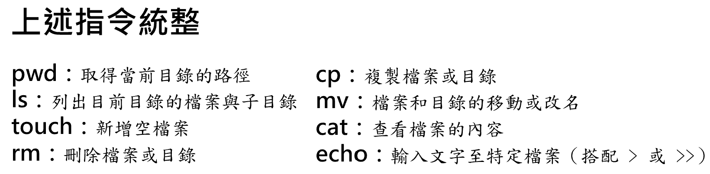
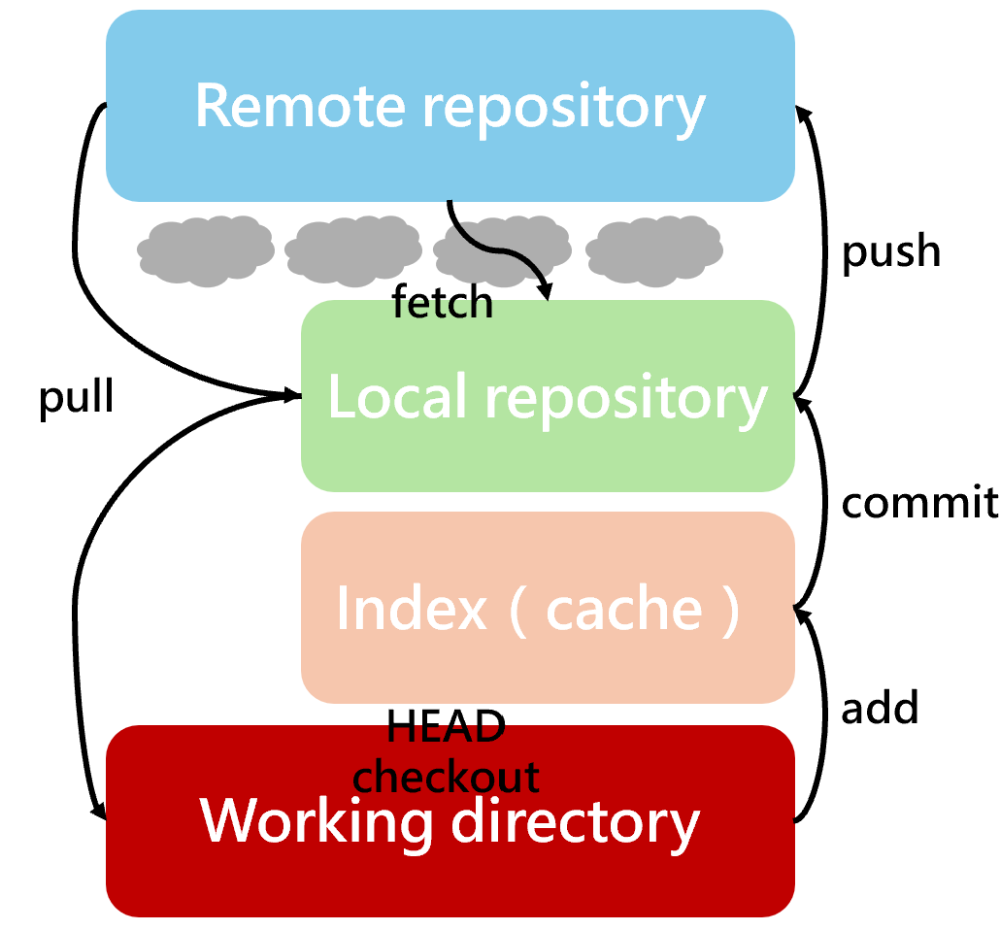
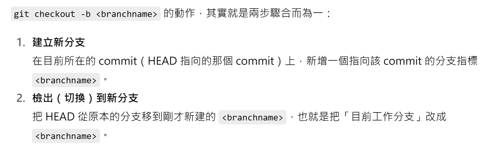

# Bash 與檔案基礎操作 
```pwd```：取得現在的目錄。  
```sh
/c/Users/User/Desktop/NTHU  
```
```ls```：取得當前的目錄，後面可以加入 ```-a```、```-l```、```-h```。  
```
-a 可以取得更詳盡的內容，像是 .git 資料夾。  
-l 可以得到一些檔案資訊，像是時間、容量大小等。  
-h 可以將 -l 轉換成更適合人類讀的內容（human），其實就是轉換成多少 B 的容量大小。  
```
**補充：** 
- 在 Git Bash 中，多半無法使用 ```man ls``` 去查資料，只能用 ```ls --help```。    

```touch```：可以新增檔案。  
```rm```：刪除檔案。  
```cp```：複製檔案。  
**補充：** 
- ```rm```、```cp``` 在處理目錄時，前面要加入 -r 才能，因為是 recursive 的意思，或是刪除目錄可以打 `rmdir <dir>`。  
- ```mv```：可以移動檔案和目錄，也可以改名。  
- ```cat```：可以查看檔案的內容。  
- 如果打的檔名太長時，可以先打幾個字再打 tab 即可。  
- 可以透過 ```echo```、```cat``` 等指令輸入文字至特定檔案，需要再查即可。  
- Git Bash 和 git 會分大小寫、Windows 檔案系統通常不區分。


<br>
<!--  -->

# 專案初始化與關於檔案的 Git 指令
以下 ```git config``` 指令為安裝完 git 要做的第一件事情。  
```git config --global user.name <username>```：輸入使用者的姓名，盡量都用英文。    
```git config --global user.email <email>```：輸入使用者的電子信箱。  
```git init```：將所在目錄給 git 初始化與管理，打完後，.git 資料夾便會出現。  
```git status```：每個檔案的狀態，非常實用!!  
```git add .``` or ```git add <file_name>```、```git commit -m <message>``` 就不用說的重要了，如果有修改、刪除、改名已經 push 的檔案，那就必須再 add、commit 一次。  
**補充：** 
- 如果要取消 add，可以打 ```git restore --staged <filename>```。  
- `git commit --amend -m "新的提交訊息"`：可以覆蓋上一筆 commit 的訊息。  
- `git commit --amend`：會開啟編輯器 Vim，修改過後按 Esc 以及輸入 `:wq` 便可以退出。  

# 檢視歷史與差異
```git log```：顯示出每個 commit，也可以再後面加上 ```<filename>``` 去看特定檔案的 commit，按 q 可以退出。  

<!--   -->

`git diff`：可以比較工作目錄檔案修改前後的差異。  
`git diff --staged`：暫存區的差異。  
`git show`：後面要加 ID（SHA1），可以看到單一 commit 的作者、時間、diff。  
`gitk`：可以顯示內建的 UI 以觀察每次 commit。  
`git-tree .`：可以跑出分頁，左邊指令、右邊 git-tree，需要先安裝相關的套件。git-tree 會涉及許多指令，像是離開頁面、左右交換、平行切割、垂直切割、交換 pane，等有需要再查即可。  
`git blame <filename>`：可以看到檔案被誰動過。  

# 遠端協作（GitHub / GitLab）
GitLab 跟 GitHub 相比做比較多 CI/CD 的功能，偏向於企業。  
GitHub 如果要下載資料可以用 https or SSH，前者通常會需要輸入帳密，除非 Git Bash 本身就有紀錄之前的帳密，不過，現在也比較不會用密碼，而是 PAT (Personal Access Token)。  
- `git remote add origin <url>`：如果是推上 GitHub 之前就有先用 Git 紀錄目錄的話，可以直接輸入此指令。  
- `git remote show origin`：可以看到是否有加成功。  
- `git push -u origin master`： 是指將 master 傳到 origin 儲存庫，-u 是指未來都會關注這兩個儲存庫（local、remote），因此，之後都只需要打 `git pull` or `git push` 即可，不需要再打 `origin`、`master` 等。 
 
**補充：** 
- git-tree 中的 origin/master 就是 GitHub 的分支。  
- 可以複製有興趣的專案下來到本機如：`git clone https://github.com/ChenYuFan1202/Git.git`。  
- 用 `git fetch` 再用 `git status` 可以知道 GitHub 上的 repo 是否有變動，如果有可以再用 `git pull`。  

# 分支、提交的切換、建立與刪除
`git checkout <SHA1> or <branchname>`：切換 commit 或分支，是為了要看之前的版本、找 bug 等。  
`git checkout <SHA1> <filename>`：可以將 `<SHA1>` 中的檔案取出並覆蓋當前的工作目錄與暫存區，如果想要取消可以輸入 ```git reset --hard <SHA1>```。  
`git checkout <SHA1> .`：是取全部資料。  
`git checkout HEAD <filename>`：如果進行檔案變更且沒有 add 的話，想要取消變更就可以輸入這個指令，也可以輸入 `git checkout -- <filename>`。   
`git checkout -- .`：是還原多個檔案的意思。  
`git branch <branchname>`：在 HEAD 新增一個分支，名為 "branchname"。  
`git branch <branchname> <SHA1>`：直接指定某個 commit 新增分支。  
`git branch -D <branchname>`：刪除名為 "branchname" 的分支。  
`git checkout <branchname>`： 和 `git checkout <SHA1>` 很像，前者是指分支，後者是到某個 commit。  
`git merge <branchname>`：將分支合併到工作目錄（HEAD），輸入合併指令後，如果有 Vim 的話，需要按 esc 鍵，然後輸入 `:wq`。  
**補充**：
- 如果合併有衝突的話，會需要手動解決，這需要溝通說要採取哪一個版本，而一旦解決衝突並且要再合併時，一樣需要 add、commit，這裡的 commit 可以不用再打 -m。  

  
   
`git cherry-pick <SHA1>`：在多個分支的狀況下，如果有想要的單一 commit 在其他分支上，就可以使用此指令，不過如果是多個 commit 的話，還是用 merge 比較好。  
**補充：**
- 最新的 commit 要有 branch，不然用 `git checkout` 到以前的版本的話，會消失。  
- 如果進行檔案的修改以及 add 後，想要回到某個 commit 時，可以使用 `git reset --soft` or `git reset --mixed` or `git reset --hard`，他們會帶著分支的指標走。這三者有不同的功能，詳情還是要實際操作瞭解比較好。  
```bash
# reset：移動 HEAD，並依模式是否重設 index/working dir
# --soft  ：只移 HEAD；index、工作目錄保留更動
# --mixed（預設）： 移 HEAD + 重設 index 至工作目錄；工作目錄保留更動
# --hard  ：移 HEAD + 重設 index + 重設工作目錄（丟更動）

git reset --soft  <target>
git reset --mixed <target> # = git reset <target>　　
git reset --hard  <target>
```
`git reflog`（reference log）：當最新的分支指標被移動或是刪除後，最新的 commit 便會不見，因此，可以透過 `git reflog` 去找 ID，並且使用 `git reset` 去指向它。  
`git rebase`：一般不太好用，雖然可以讓線變一條線、比較好看，然而，卻也很容易有衝突，這會非常複雜。  
`git stash`：目前工作還沒到一個段落，但又被臨時交辦事情。這個指令可以儲存目前的工作目錄至 git 內部暫存堆疊，之後也可以再還原至 HEAD。此外，可以使用 `git stash push -m "訊息"` 暫存並記錄。  
`git stash list`：列出目前已經存放在堆疊的內容。  
`git stash pop`：還原暫存堆疊的內容。  
`git stash drop`：刪除暫存堆疊的內容。  

# 其他指令
`git revert ID`：會新增一個 commit，主要是將之前的 commit 做取消。  
`git diff --cached`：這和 `git diff` 的差別是當 `git add .` 後，用 `git diff` 會看不到結果，所以要加上 `--cached`，要注意的是，如果 commit 後也不會看到。  
`git diff --name-status`：這可以看到目前工作目錄上修改、刪除的檔案。如果 add 後，也需要加上 `--cached`。  
`git log -S <keyword>`：在 log 中搜尋是否有 `<keyword>` 的 log，有分大小寫!  
`git log -S <keyword> -p`：`-p` 的意思是 patch，在顯示提交紀錄時，同時輸出每個 commit 的差異內容（diff）。  
**補充：**
- -S 是 String 的意思。  

`git log --since --until` 和 `git log --author`：顧名思義，要注意的是 author 可以是 email。  
`git log -n <number>`：可以顯示最新的幾筆 log，也可以直接輸入 `git log -<number>`。  
`git log --all --decorate --oneline --graph --color=always`：顯示的內容跟 `git-tree .` 一樣。  
`git bisect`：用二分搜尋法找出 bug 的源頭，要一直標住 bad or good。  
<a href="https://www.toptal.com/developers/gitignore/">Gitignore.io</a> 可以直接針對特定的系統給出需要忽視的檔案。  

`git branch -av`：可以看到本機和遠端的分支。 和 `git branch -vv` 很像，v 可以看到和遠端差多少 commit。   
**補充：** 
- 要 push 時，第一次最好輸入 `git push -u origin <branchname>` or `git push --set-upstream origin <branchname>`，這樣之後才能直接用 `git push` or `git pull`。

`git branch --set-upstream-to=origin/<branchname> <branchname>` or `git branch -u origin/<branchname> <branchname>`：這是用在遠端的分支已經被建立，而本機是剛建立並且想要連接起來的時候。  
`git push origin :<branchname>`：刪除遠端分支。  
`git remote prune origin`：用在已經刪除遠端分支，但還留遠端的追蹤分支在本機上。  